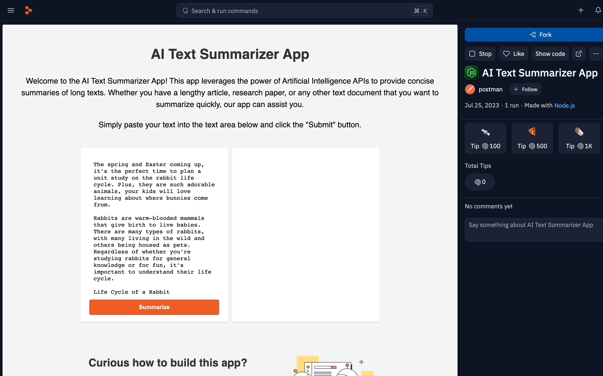

# AI-Text-Summarizer-App
## Tech Stack

These are the tools and technologies that i used to build the app!

### API platform

* **Postman** 

### Code Editor/Deployment tool

* **Replit** 

### Back End

* **Node.js** 
* **Express**
* **framework**

* **Hugging Face Inference API** 

### Front End

* **HTML**
* **CSS**
* **JavaScript**

 
